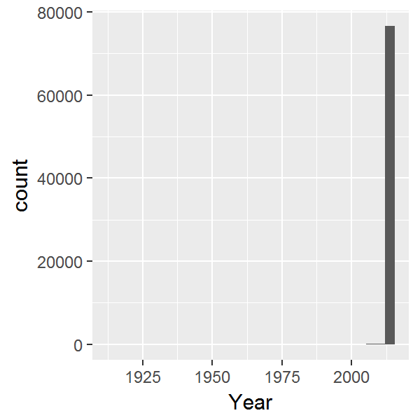
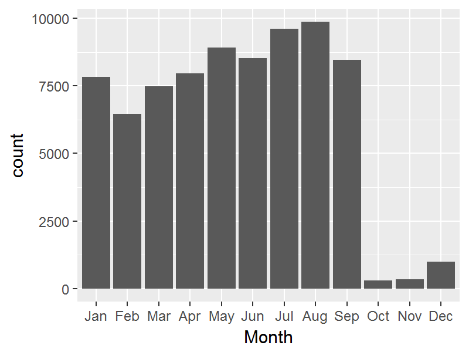
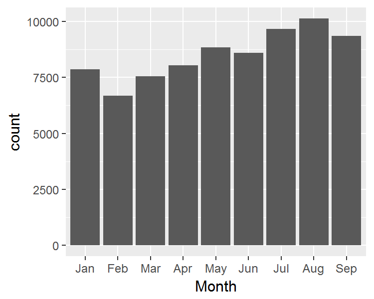
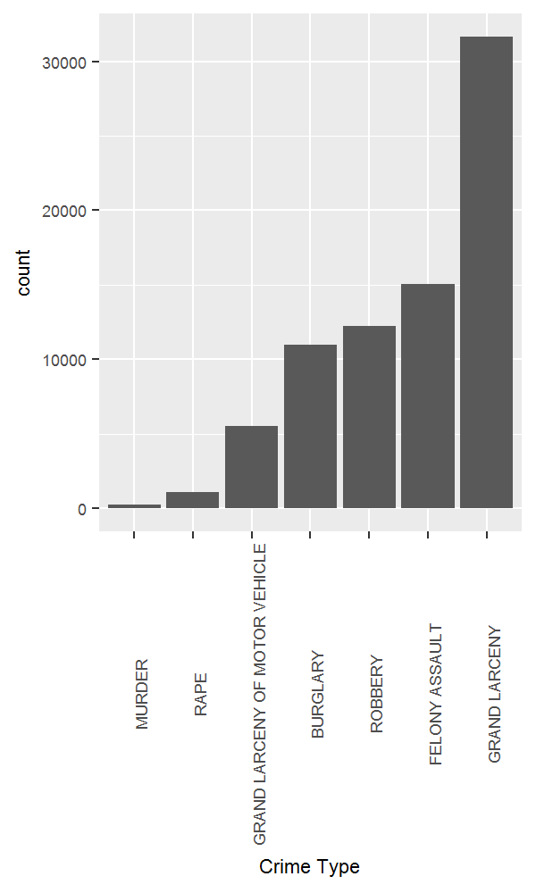
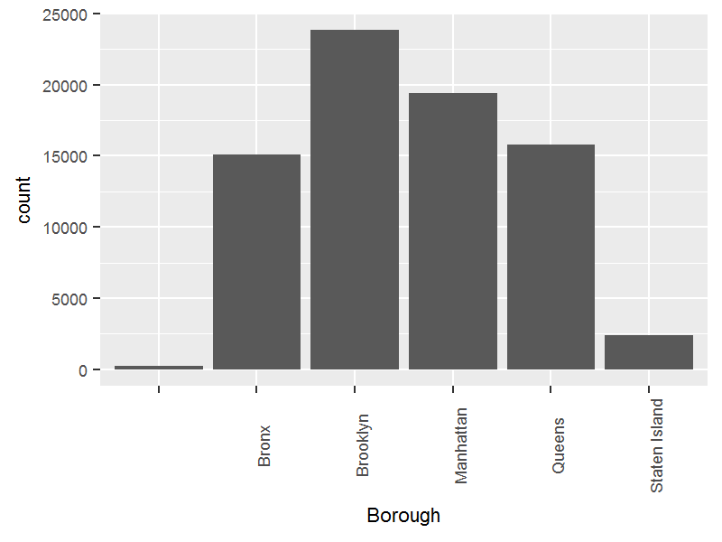
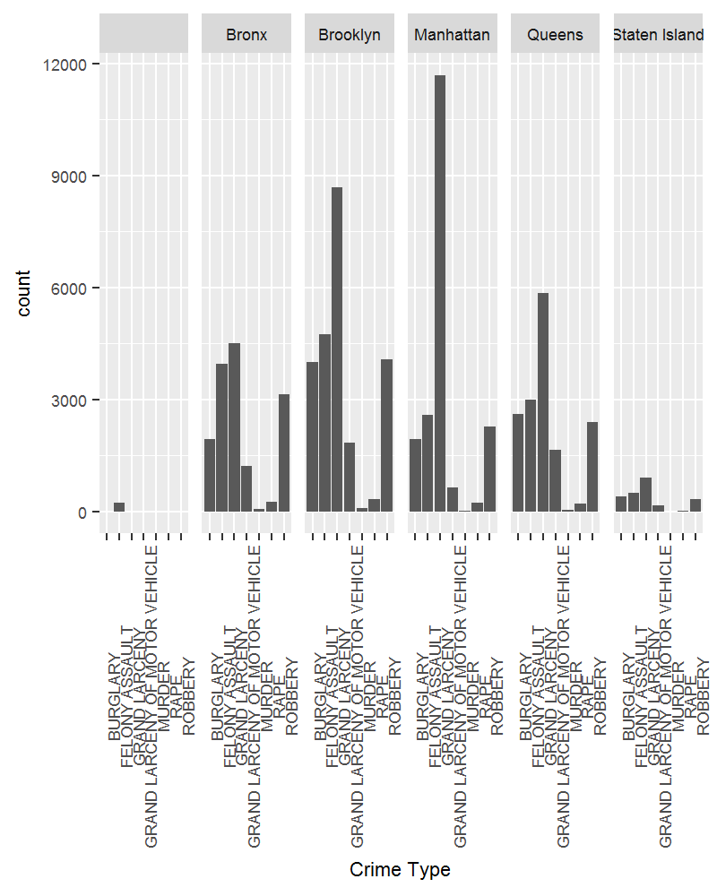
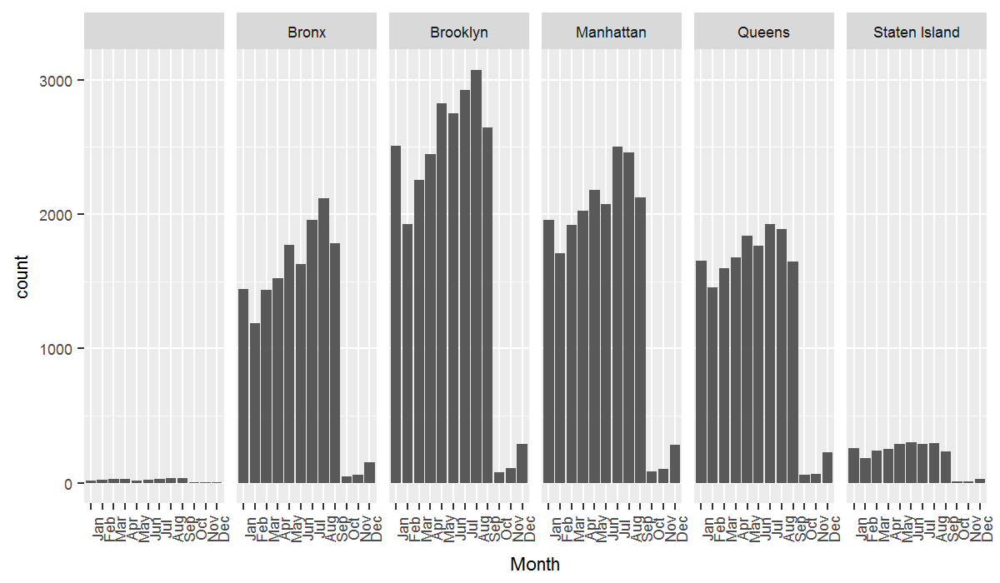
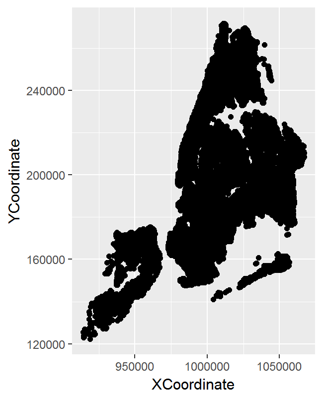
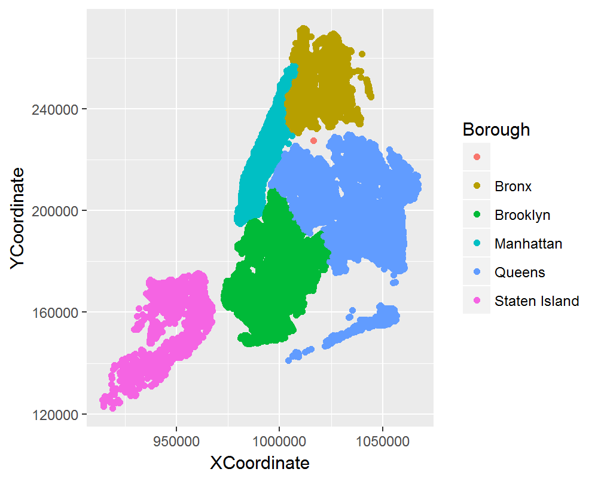
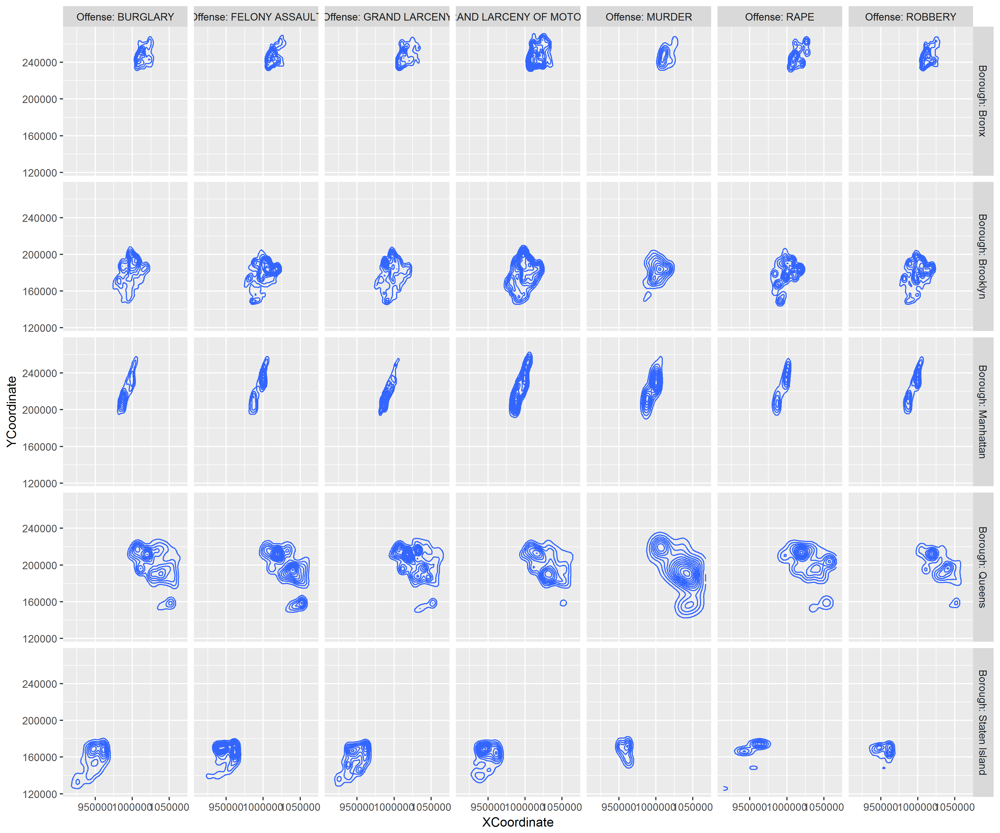

# NYPD Crime Data
Ben Goldy  
April 5, 2017  


#Descriptives {.tabset}
##Occurence Year

```r
ggplot(Felony,
       aes(x=OccurrenceYear))+
  geom_histogram()+xlab("Year")
```

<!-- -->

Its fairly clear that the present data is mostly from one year: 2015.

##Occurence Month

```r
ggplot(Felony,
       aes(x=OccurrenceMonth))+
  geom_histogram(stat="count")+
  xlab("Month")
```

<!-- -->

##Reported Month

```r
ggplot(Felony,
       aes(x=CompStatMonth))+
  geom_histogram(stat="count")+
  xlab("Month")
```

<!-- -->

Interestingly, October, November and December have no reported incidents, even though those months have crime occurences. Given that the distrubtions are the same for the months that present, it seems safe to say this an error with the present data.

##Crime Type

```r
crimetype=Felony%>%
  group_by(Offense)%>%
  mutate(Count=n())

ggplot(crimetype,
       aes(x=reorder(Offense,
                     Count)))+
  geom_histogram(stat="count")+
  xlab("Crime Type")+
  theme(
    axis.text.x=element_text(angle=90,vjust=1),
    text=element_text(size=8))
```

<!-- -->

#Borough Interactions {.tabset}
##Total Crime by Borough

```r
ggplot(Felony,
       aes(x=Borough))+
  geom_histogram(stat="count")+
  xlab("Borough")+
  theme(
    axis.text.x=element_text(angle=90),
    text=element_text(size=8))
```

<!-- -->

Again we see some errors in the data with missing borough classifications. Despite that crime rates in Staten Island are far lower than elshwere. Of the five boroughs, Brookly has the most reported crime.

##Borough by Crime Type

```r
ggplot(Felony,
       aes(x=Offense))+
  geom_histogram(stat="count")+
  xlab("Crime Type")+
  facet_grid(~Borough)+
  theme(
    axis.text.x=element_text(angle=90),
    text=element_text(size=8))
```

<!-- -->

The distribution of crime according to its type is relatively consistent accross the five boroughs. Grand Larceny is the most represented crime type by a large margin in all five boroughs. Furthermore, Felony assault is the second most common form of crime in all five boroughs.

##Borough by Month

```r
ggplot(Felony,
       aes(x=OccurrenceMonth))+
  geom_histogram(stat="count")+
  xlab("Month")+
  facet_grid(~Borough)+
  theme(
    axis.text.x=element_text(angle=90),
    text=element_text(size=8))
```

<!-- -->

#Spatial Data {.tabset}
Given the above results, there does not appear to be a strong difference between the five boroughs in terms of when crime occurs or what type of crimes are likely to occur. There is however differences in the absolute number of occurences.

But what about spatially? We'll plot the x,y coordinate data to get a sense of where the crimes being reported are coming from:

##All Spatial Data

```r
ggplot(Felony%>%
         filter(OccurrenceYear==2015),
       aes(x=XCoordinate,
           y=YCoordinate))+
  geom_point()
```

<!-- -->

##Colored by Borough

```r
ggplot(Felony%>%
         filter(OccurrenceYear==2015),
       aes(x=XCoordinate,
           y=YCoordinate,
           color=Borough))+
  geom_point()
```

<!-- -->

#Crime Patterns Overview

The next natural question to ask is: "are there differences in where the various types of crime are committed within a given borough?".


```r
ggplot(Felony%>%filter(Borough!=""),aes(x=XCoordinate,y=YCoordinate))+geom_density2d()+facet_grid(Borough~Offense,labeller=label_both)
```

<!-- -->

Broadly speaking there does appear to be differences in centers of activity for the various types of crimes. Investigation into what factors may be driving these differences could be of use in a variety of contexts but is outside the scope of what is possible given the present data.
