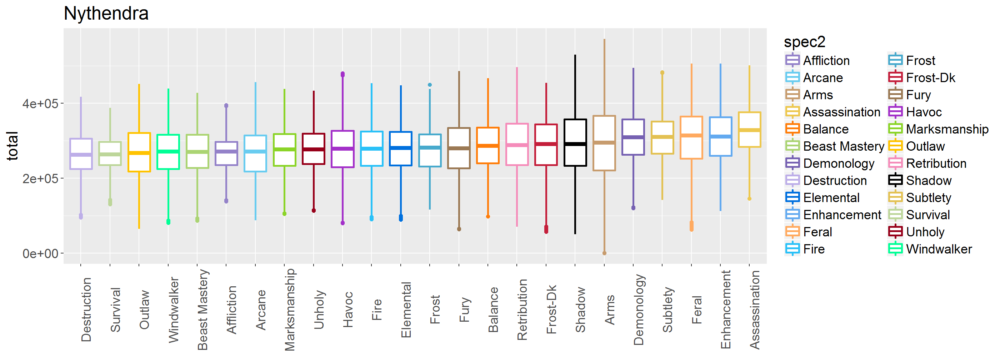
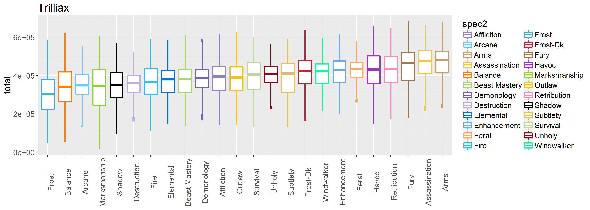
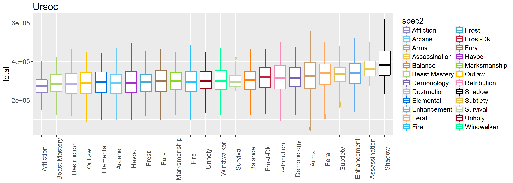
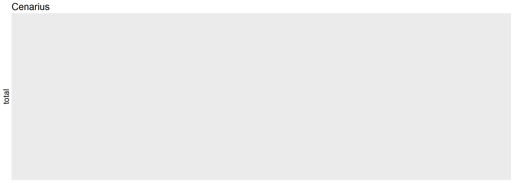
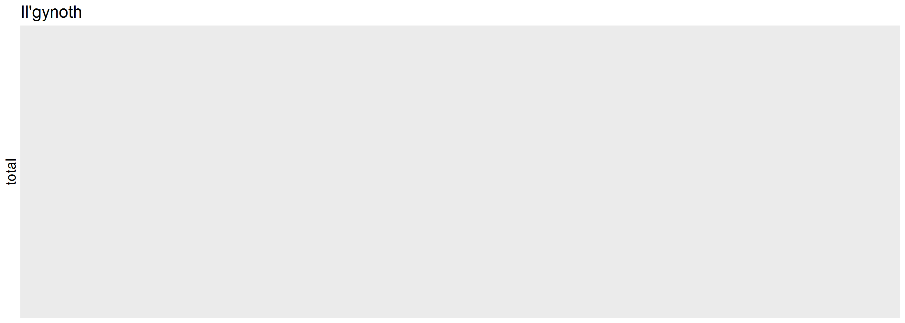
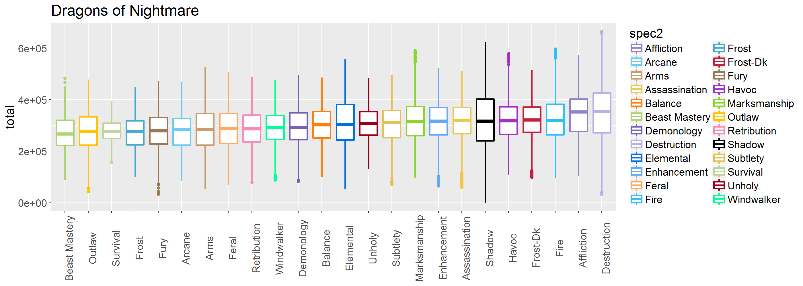
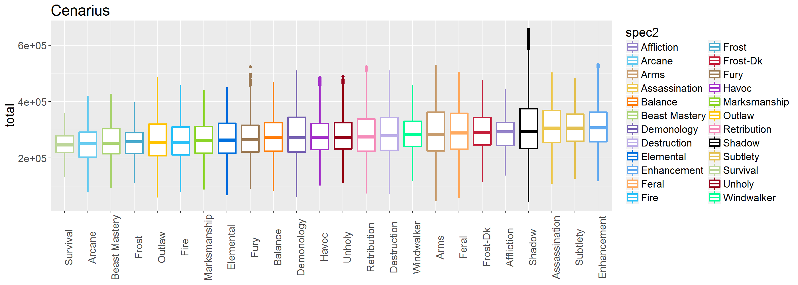
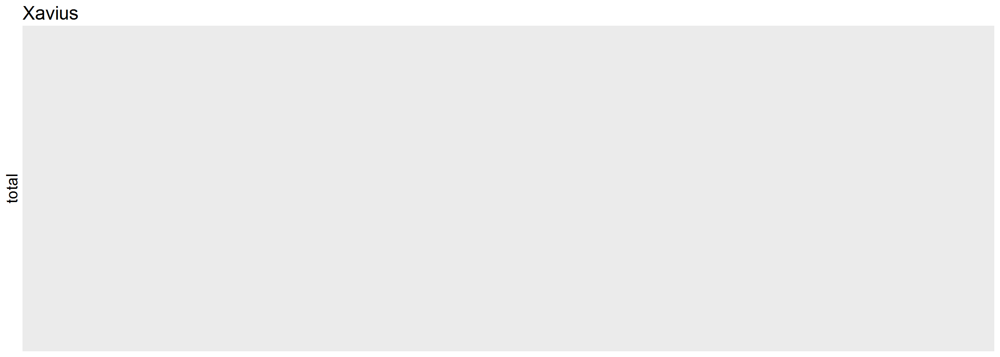

# Emerald Nightmare DPS Comparison - Heroic
JyuNyar  
November 10, 2016  


#Data Summary

Item level Distribution Heroic: 

##Data Cleanup

Data was cleaned using the median absolute deviation. For each spec + fight + difficulty combination, an exclusion criterion was calculated as follows:

$$Lower Bound = median - 2.5*MAD$$
$$Upper Bound = median + 2.5*MAD$$

Observations that fell either below the lower bound, or above the upper bound, were excluded.


```r
parses=parses%>%filter(itemLevel>839)

parses.filtered=parses%>%
  group_by(spec2,Fight,difficulty)%>%
  mutate(
    Count=n(),
    Omit=ifelse(Count<100,1,0))%>%
  filter(Omit==0,itemLevel>839)%>%
  ungroup()%>%
  group_by(spec2)%>%
  mutate(
    fullMedian=median(total))%>%
  ungroup()%>%
  group_by(spec2,Fight,difficulty)%>%
  mutate(
    lower = (median(total)-2.5*mad(total)),
    medianDPS=median(total),
    upper = (median(total)+2.5*mad(total)))%>%
  ungroup()%>%
  mutate(
    Outlier=ifelse(total<lower,1,
                   ifelse(total>upper,1,0)))%>%
  filter(Outlier==0)
```

Plotting function:


```r
boxplot=function(fight,difficulty,pal,data){
    ggplot(
      data%>%
        filter(Fight==fight,difficulty==difficulty),aes(x=reorder(spec2,medianDPS),y=total,color=spec2))+
    geom_boxplot(lwd=1)+
    scale_colour_manual(values=pal)+
    theme(
      axis.text.x=element_text(angle=90,vjust=1),
      axis.title.x=element_blank(),
      text=element_text(size=16))+
    labs(title=fight)
}
```

Palette:

```r
palette.alphabetical=c("#9482C9","#69CCF0","#C79C6E","#EDC84F","#FF7D0A","#ABD473","#7661B2","#BDAEE8","#0070DE","#63AAF0","#FFAA60","#2AC1F8","#48AACD","#C41F3B","#9B7954","#A330C9","#8BD428","#FFC300","#F58CBA","#000000","#E3C153","#BDD69A","#97001A","#00FF96")
```

#Heroic {.tabset}
##Heroic Skorpyron

```r
boxplot("Skorpyron","Heroic",palette.alphabetical,parses.filtered)
```

<!-- -->

##Heroic Chronomatic Anomaly

```r
boxplot("Chronomatic Anomaly","Heroic",palette.alphabetical,parses.filtered)
```

<!-- -->

##Heroic Trilliax

```r
boxplot("Trilliax","Heroic",palette.alphabetical,parses.filtered)
```

<!-- -->

##Heroic Spellblade Aluriel

```r
boxplot("Spellblade Aluriel","Heroic",palette.alphabetical,parses.filtered)
```

<!-- -->

##Heroic Tichondrius

```r
boxplot("Tichondrius","Heroic",palette.alphabetical,parses.filtered)
```

<!-- -->

##Heroic Krosus

```r
boxplot("Krosus","Heroic",palette.alphabetical,parses.filtered)
```

<!-- -->

##Heroic High Botanist Tel'arn

```r
boxplot("High Botanist Tel'arn","Heroic",palette.alphabetical,parses.filtered)
```

<!-- -->

##Heroic Grand Magistrix Elisande

```r
boxplot("Grand Magistrix Elisande","Heroic",palette.alphabetical,parses.filtered)
```

<!-- -->

##Heroic Gul'dan

```r
boxplot("Gul'dan","Heroic",palette.alphabetical,parses.filtered)
```

<!-- -->

#Mythic {.tabset}
##Mythic Skorpyron

```r
boxplot("Skorpyron","Mythic",palette.alphabetical,parses.filtered)
```

<!-- -->

##Mythic Il'gynoth

```r
boxplot("Il'gynoth","Mythic",palette.alphabetical,parses.filtered)
```

<!-- -->

##Mythic Dragons of Nightmare

```r
boxplot("Dragons of Nightmare","Mythic",palette.alphabetical,parses.filtered)
```

<!-- -->

##Mythic Renferal

```r
boxplot("Renferal","Mythic",palette.alphabetical,parses.filtered)
```

<!-- -->

##Mythic Ursoc

```r
boxplot("Ursoc","Mythic",palette.alphabetical,parses.filtered)
```

<!-- -->

##Mythic Cenarius

```r
boxplot("Cenarius","Mythic",palette.alphabetical,parses.filtered)
```

<!-- -->

##Mythic Xavius

```r
boxplot("Xavius","Mythic",palette.alphabetical,parses.filtered)
```

<!-- -->
